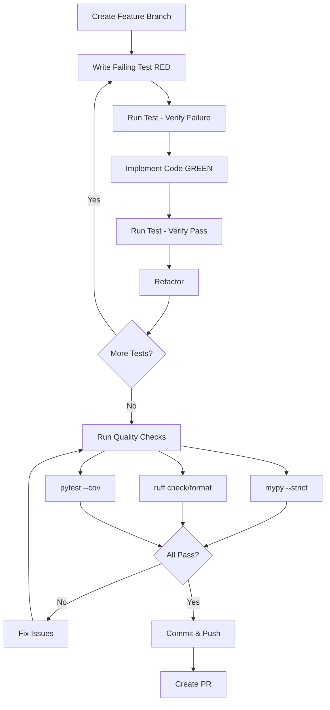

# Development Guide

Welcome to the Echomine development documentation! This section contains detailed guides for contributors working on the project.

## Quick Navigation

### Getting Started
- **[Setup Guide](setup.md)**: Environment setup and installation
- **[Workflows](workflows.md)**: Common development workflows

### Development Standards
- **[Testing Guide](testing.md)**: Writing and running tests (TDD)
- **[Type Checking](type-checking.md)**: mypy --strict usage and patterns
- **[Documentation](documentation.md)**: Writing docs and docstrings

## Overview

Echomine follows strict development practices to ensure quality, type safety, and maintainability. All contributors must follow these standards.

### Core Principles

1. **Test-Driven Development (TDD)**
   - Write tests FIRST (RED phase)
   - Implement minimal code to pass (GREEN phase)
   - Refactor while keeping tests green (REFACTOR phase)

2. **Type Safety**
   - mypy --strict must pass with zero errors
   - All functions must have type hints
   - No `Any` types in public API

3. **Library-First Architecture**
   - Core functionality in `src/echomine/` (importable library)
   - CLI wraps library, never the reverse
   - All features available programmatically

4. **Memory Efficiency**
   - O(1) memory usage via streaming
   - ijson for parsing large files
   - Generator patterns for all iterations

For complete development guidelines, see **[CONTRIBUTING.md](https://github.com/echomine/echomine/blob/master/CONTRIBUTING.md)**.

## Development Workflow Overview



## Quick Reference Commands

### Testing
```bash
# All tests with coverage
pytest --cov=echomine --cov-report=term-missing

# Unit tests only (fast)
pytest tests/unit/ -v

# Watch mode (requires pytest-watch)
ptw -- tests/unit/
```

### Type Checking
```bash
# Strict type checking
mypy --strict src/echomine/

# Check with tests too
mypy --strict src/echomine/ tests/
```

### Linting and Formatting
```bash
# Auto-fix linting issues
ruff check --fix src/ tests/

# Format code
ruff format src/ tests/

# Check without making changes
ruff check src/ tests/
ruff format --check src/ tests/
```

### Pre-Commit
```bash
# Run all hooks
pre-commit run --all-files

# Run specific hook
pre-commit run mypy --all-files
```

### Documentation
```bash
# Build docs locally
mkdocs build

# Serve docs with live reload
mkdocs serve

# Deploy to GitHub Pages
mkdocs gh-deploy
```

## Project Structure

```
echomine/
├── src/echomine/           # Library (importable, reusable)
│   ├── models/             # Pydantic data models
│   ├── protocols/          # Protocol definitions
│   ├── adapters/           # Provider implementations
│   ├── search/             # Search and ranking
│   ├── utils/              # Utilities (logging, exceptions)
│   └── cli/                # CLI commands (wraps library)
├── tests/
│   ├── unit/               # Fast, isolated tests (70%)
│   ├── integration/        # Component interaction (20%)
│   ├── contract/           # Protocol compliance (5%)
│   ├── performance/        # Benchmarks (5%)
│   └── fixtures/           # Test data
├── docs/                   # Documentation (mkdocs)
├── specs/                  # Feature specifications
└── .claude/                # AI agent coordination
```

## Development Standards

### Code Quality Gates

All code must pass these checks before merging:

- ✅ **Tests**: `pytest` passes with >80% coverage
- ✅ **Type Checking**: `mypy --strict` passes with zero errors
- ✅ **Linting**: `ruff check` passes
- ✅ **Formatting**: `ruff format --check` passes
- ✅ **Documentation**: All public APIs have docstrings
- ✅ **Conventional Commits**: Commit messages follow format

### Constitution Principles

The project follows 8 constitution principles (non-negotiable):

1. **Library-First Architecture**
2. **CLI Interface Contract** (stdout/stderr separation)
3. **Test-Driven Development** (TDD mandatory)
4. **Observability & Debuggability** (JSON logs)
5. **Simplicity & YAGNI**
6. **Strict Typing Mandatory** (mypy --strict)
7. **Multi-Provider Adapter Pattern**
8. **Memory Efficiency & Streaming**

For details, see [Architecture](../architecture.md) or `specs/001-ai-chat-parser/constitution.md`.

## Getting Help

- **General Development**: Read [CONTRIBUTING.md](https://github.com/echomine/echomine/blob/master/CONTRIBUTING.md)
- **Setup Issues**: See [Setup Guide](setup.md)
- **Testing Questions**: See [Testing Guide](testing.md)
- **Type Errors**: See [Type Checking Guide](type-checking.md)
- **Other Questions**: [Open an issue](https://github.com/echomine/echomine/issues/new/choose) or [start a discussion](https://github.com/echomine/echomine/discussions)

## Next Steps

1. **New to the project?** Start with [Setup Guide](setup.md)
2. **Ready to code?** Review [Workflows](workflows.md)
3. **Writing tests?** See [Testing Guide](testing.md)
4. **Type errors?** Check [Type Checking Guide](type-checking.md)
5. **Updating docs?** Read [Documentation Guide](documentation.md)

---

**Last Updated**: 2025-11-28
