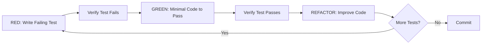

# Testing Guide

Echomine follows strict Test-Driven Development (TDD) practices. This guide covers how to write, organize, and run tests.

## TDD Workflow (Mandatory)

All development must follow the RED-GREEN-REFACTOR cycle:



### 1. RED Phase

Write a test that describes the expected behavior. **Run it to verify it fails.**

```python
def test_search_returns_matching_conversations():
    """Test that search finds conversations containing keywords."""
    adapter = OpenAIAdapter()
    query = SearchQuery(keywords=["python", "algorithm"])

    results = list(adapter.search(SAMPLE_EXPORT, query))

    assert len(results) > 0
    assert all("python" in r.conversation.title.lower() or
               "algorithm" in r.conversation.title.lower()
               for r in results)
```

Run and confirm failure:
```bash
pytest tests/unit/test_search.py::test_search_returns_matching_conversations -v
# Should FAIL because feature isn't implemented
```

### 2. GREEN Phase

Write the **minimum** code to make the test pass. Don't over-engineer.

### 3. REFACTOR Phase

Improve the code while keeping tests green. Run tests after each change.

## Test Organization

### Test Pyramid

```
        /\
       /  \      Contract Tests (5%)
      /----\     - Protocol compliance
     /      \    - FR validation
    /--------\   Integration Tests (20%)
   /          \  - Component interaction
  /------------\ Unit Tests (70%)
 /              \- Fast, isolated, focused
/________________\
```

### Directory Structure

```
tests/
├── unit/                    # Fast, isolated tests
│   ├── test_conversation.py # Model tests
│   ├── test_message.py
│   ├── test_search.py
│   └── adapters/
│       └── test_openai.py
├── integration/             # Component interaction
│   ├── test_cli_integration.py
│   └── test_search_pipeline.py
├── contract/                # Protocol/spec compliance
│   ├── test_fr_search.py    # Functional requirements
│   └── test_provider_protocol.py
├── performance/             # Benchmarks
│   └── test_search_performance.py
├── fixtures/                # Test data
│   ├── sample_export.json
│   └── conftest.py          # Shared fixtures
└── conftest.py              # Root fixtures
```

## Running Tests

### All Tests

```bash
# Run all tests with coverage
pytest --cov=echomine --cov-report=term-missing

# Run with verbose output
pytest -v

# Run with extra verbose (show print statements)
pytest -vvs
```

### Specific Test Types

```bash
# Unit tests only (fast)
pytest tests/unit/ -v

# Integration tests
pytest tests/integration/ -v

# Contract tests
pytest tests/contract/ -v

# Performance benchmarks
pytest tests/performance/ --benchmark-only
```

### Specific Tests

```bash
# Single file
pytest tests/unit/test_search.py -v

# Single test function
pytest tests/unit/test_search.py::test_search_with_keywords -v

# Tests matching pattern
pytest -k "search" -v

# Tests with specific marker
pytest -m "slow" -v
pytest -m "not slow" -v
```

### Watch Mode

```bash
# Auto-run tests on file changes (requires pytest-watch)
pip install pytest-watch
ptw -- tests/unit/
```

## Writing Tests

### Test Naming

Use descriptive names that explain the expected behavior:

```python
# Good: Describes behavior
def test_search_returns_empty_list_when_no_matches():
    pass

def test_search_ranks_results_by_relevance_score():
    pass

def test_stream_conversations_skips_malformed_entries():
    pass

# Bad: Vague names
def test_search():
    pass

def test_it_works():
    pass
```

### Test Structure (Arrange-Act-Assert)

```python
def test_search_filters_by_date_range():
    # Arrange: Set up test data and dependencies
    adapter = OpenAIAdapter()
    query = SearchQuery(
        keywords=["python"],
        from_date=datetime(2024, 1, 1, tzinfo=UTC),
        to_date=datetime(2024, 6, 30, tzinfo=UTC),
    )

    # Act: Execute the code under test
    results = list(adapter.search(SAMPLE_EXPORT, query))

    # Assert: Verify expected behavior
    assert len(results) > 0
    for result in results:
        assert result.conversation.created_at >= query.from_date
        assert result.conversation.created_at <= query.to_date
```

### Using Fixtures

```python
# conftest.py
import pytest
from pathlib import Path

@pytest.fixture
def sample_export() -> Path:
    """Path to sample export file."""
    return Path(__file__).parent / "fixtures" / "sample_export.json"

@pytest.fixture
def adapter() -> OpenAIAdapter:
    """Fresh adapter instance."""
    return OpenAIAdapter()

# test_search.py
def test_search_with_keywords(adapter, sample_export):
    query = SearchQuery(keywords=["python"])
    results = list(adapter.search(sample_export, query))
    assert len(results) > 0
```

### Parametrized Tests

```python
import pytest

@pytest.mark.parametrize("keywords,expected_min_results", [
    (["python"], 3),
    (["algorithm"], 2),
    (["nonexistent"], 0),
])
def test_search_keyword_variations(adapter, sample_export, keywords, expected_min_results):
    query = SearchQuery(keywords=keywords)
    results = list(adapter.search(sample_export, query))
    assert len(results) >= expected_min_results
```

### Testing Exceptions

```python
import pytest

def test_search_raises_on_nonexistent_file(adapter):
    query = SearchQuery(keywords=["test"])

    with pytest.raises(FileNotFoundError):
        list(adapter.search(Path("/nonexistent/file.json"), query))

def test_validation_error_on_invalid_query():
    with pytest.raises(ValidationError) as exc_info:
        SearchQuery(limit=-1)  # Invalid: must be positive

    assert "limit" in str(exc_info.value)
```

### Mocking

```python
from unittest.mock import Mock, patch

def test_progress_callback_invoked(adapter, sample_export):
    callback = Mock()
    query = SearchQuery(keywords=["python"])

    list(adapter.search(sample_export, query, progress_callback=callback))

    assert callback.call_count > 0

@patch("echomine.adapters.openai.adapter.ijson")
def test_handles_parse_error(mock_ijson, adapter, sample_export):
    mock_ijson.items.side_effect = ijson.JSONError("Parse error")

    with pytest.raises(ParseError):
        list(adapter.stream_conversations(sample_export))
```

## Test Coverage

### Running Coverage

```bash
# Terminal report
pytest --cov=echomine --cov-report=term-missing

# HTML report (detailed)
pytest --cov=echomine --cov-report=html
open htmlcov/index.html

# XML report (for CI)
pytest --cov=echomine --cov-report=xml
```

### Coverage Requirements

- **Critical paths**: >80% coverage required
- **Overall**: >70% coverage target
- **New code**: 100% coverage for new features

### Excluding from Coverage

```python
# pragma: no cover - for unreachable code
def _debug_helper():  # pragma: no cover
    """Only used in development."""
    pass
```

## Performance Testing

### Using pytest-benchmark

```python
def test_search_performance(benchmark, adapter, large_export):
    """Search 10K conversations completes in <5 seconds."""
    query = SearchQuery(keywords=["python"], limit=100)

    result = benchmark(lambda: list(adapter.search(large_export, query)))

    # Verify result correctness
    assert len(result) <= 100

    # Performance assertion
    assert benchmark.stats.stats.mean < 5.0  # seconds

def test_stream_memory_efficiency(benchmark, adapter, large_export):
    """Streaming uses O(1) memory."""
    def consume_stream():
        count = 0
        for _ in adapter.stream_conversations(large_export):
            count += 1
        return count

    result = benchmark(consume_stream)
    assert result > 0
```

### Running Benchmarks

```bash
# Run benchmarks
pytest tests/performance/ --benchmark-only

# Compare with baseline
pytest tests/performance/ --benchmark-compare

# Save baseline
pytest tests/performance/ --benchmark-save=baseline
```

## Test Markers

```python
# Mark slow tests
@pytest.mark.slow
def test_large_file_processing():
    pass

# Mark integration tests
@pytest.mark.integration
def test_cli_search_command():
    pass

# Skip conditionally
@pytest.mark.skipif(sys.platform == "win32", reason="Unix-only test")
def test_unix_permissions():
    pass
```

Run specific markers:
```bash
pytest -m "not slow"  # Skip slow tests
pytest -m "integration"  # Only integration
```

## Best Practices

### Do

- Write tests FIRST (TDD)
- Use descriptive test names
- Test one behavior per test
- Use fixtures for shared setup
- Test edge cases and error conditions
- Keep tests fast (<1s per unit test)

### Don't

- Write tests after implementation
- Test implementation details (test behavior)
- Use sleep() in tests (use mocks)
- Share state between tests
- Ignore flaky tests (fix them)

## Debugging Tests

```bash
# Show print output
pytest -vvs tests/unit/test_search.py

# Drop into debugger on failure
pytest --pdb tests/unit/test_search.py

# Run specific failing test
pytest tests/unit/test_search.py::test_search_with_keywords -vvs
```

## Next Steps

- [Type Checking](type-checking.md): mypy --strict patterns
- [Development Workflows](workflows.md): Common patterns
- [Contributing](../contributing.md): Contribution guidelines

---

**Last Updated**: 2025-11-30